# OSNotes

> **Your notes. Your files. Your freedom.**

A powerful, open-source note-taking app for Android that puts you back in control of your handwritten notes.

[](LICENSE)
[](https://www.android.com/)
[](https://kotlinlang.org/)

---

## 📖 The Journey

**OSNotes was born from a simple belief:** Your notes should belong to you, not to an app.

It started with frustration.

I was hopping from one note-taking app to another, chasing features. *This one has better pen tools. That one has nicer templates. Oh, but that feature? That's premium.* The cycle was exhausting.

But the real breaking point came when I tried to export my notes.

My handwritten notes. My canvas creations. My thoughts captured stroke by stroke over months of work. And I couldn't get them out. Not properly. Not fully. The app held them hostage in some proprietary format, as if my own notes didn't belong to me. Canvas exports were horrible. Sometime half of the canvus sometime one tenth. Headache with color, theme and more 

That's when it hit me:

> **Can tere be any way to get out of this app based lockdown? Why do I need to be dependent on one particular app to read my own note? one if tomorrow reading also becomes a premium feature?**

Other apps treat your notes as *their* data. They lock features behind paywalls. They trap your work in formats only *they* can read. They make you need them—forever.

OSNotes is a refusal to that.

So I started building. The annotation engine (the heart of OSNotes) began as part of my other project, [OSPdfReader](https://github.com/AsokaKrsna/OSPdfReader). I realized this engine could power something bigger: a note-taking app that puts **you** back in control. We already had the foundation, needed some polish and wrapper functions. 

OSNotes also believe on customiztion and you will feel that while using the powerful template bulder. The tools are yours, create what you can dream of, create what you are in need of. 
---

## 💡 Philosophy

### 📁 Files Beyond Apps
This is the core ideology of OSNotes.

Your notes are saved as **standard PDF files**, not locked in a database, not wrapped in a proprietary format. Just PDFs.

What does this mean for you?
- Open your notes with **any PDF reader**, on **any device**
- Share them instantly, no export needed
- Access them always - **even if you uninstall OSNotes**
- Your notes will outlive any app, including this one **(Imaginator may fade, but imagination should endure - preserved in notes, handed down through generations.)**

### 🔓 Open Source, No Paywalls
Note-taking is a fundamental need.

Every feature in OSNotes is free. Forever. No subscriptions. No "Pro" version. No artificial limitations. The source code is open for anyone to inspect, learn from and improve.

This project exists to promote open-sourceness and break free from the paywall culture that plagues productivity apps.

### 🎨 Your Creativity, Your Rules
Everyone takes notes differently. OSNotes doesn't force a workflow on you - it adapts to yours. It may not be able to offer full customization at the moment, feel free to raise and issue, letting us know what you need.

High customizability meets powerful tools. Multiple pen presets. Shape tools, lasso selection. Customize colors, widths and behaviors. Make it truly yours.

---

## ✨ Features

### 🎨 Powerful Annotation Engine
The same engine that powers [OSPdfReader](https://github.com/AsokaKrsna/OSPdfReader)—refined and enhanced:

- **Pressure-sensitive pens** with multiple presets and independent color/width settings
- **Shape tools** — rectangle, circle, line, arrow, triangle (filled or outlined)
- **Text annotations** for typed notes alongside handwriting
- **Eraser** with visual cursor feedback
- **Lasso selection** for moving, resizing, and editing annotations

### 📄 Advanced PDF Management
- **Batch page operations** (delete, duplicate, move, reorder)
- **Template system** for custom page layouts
- **Page manager** with visual thumbnails
- **Zoom and pan** with smooth gestures
- **Multi-page documents** with easy navigation

### 🎯 Smart Organization
- **Folders** for organizing notes
- **Favorites** for quick access
- **Recent notes** on home screen
- **Rename and delete** with safety checks
- **Search** across all notes *(coming soon)*

### 🎨 Beautiful Design
- **Material Design 3** with dynamic colors
- **Dark/Light themes** that adapt to your system
- **Glassmorphic UI** with frosted glass effects
- **Smooth animations** and micro-interactions
- **Responsive layouts** for phones and tablets

### 🔒 Privacy First
- **Local storage only** - your notes never leave your device
- **No tracking, no analytics, no telemetry**
- **No account required**
- **No internet permission needed**

## 🚀 Getting Started

### Download
Download the latest APK from the [Releases](https://github.com/AsokaKrsna/OSNotes/releases) page.

### Build from Source
```bash
# Clone the repository
git clone https://github.com/AsokaKrsna/OSNotes.git
cd OSNotes

# Open in Android Studio
# Build > Make Project
# Run > Run 'app'
```

### Requirements
- Android 7.0 (API 24) or higher
- 50 MB free storage

## 🛠️ Tech Stack

Built with modern Android development tools:

- **Kotlin** - Modern, concise, safe
- **Jetpack Compose** - Declarative UI framework
- **Material Design 3** - Beautiful, adaptive design
- **MuPDF** - Fast, reliable PDF rendering
- **Room Database** - Local data persistence
- **Hilt** - Dependency injection
- **Coroutines & Flow** - Async programming
- **Navigation Compose** - Type-safe navigation

### Core Libraries
- [MuPDF](https://mupdf.com/) - PDF rendering and manipulation
- [Jetpack Compose](https://developer.android.com/jetpack/compose) - UI framework
- [Room](https://developer.android.com/training/data-storage/room) - Database
- [Hilt](https://dagger.dev/hilt/) - Dependency injection
and more. 

**Huge thanks to the open-source community** for these incredible tools that make OSNotes possible.

## 🎨 Screenshots

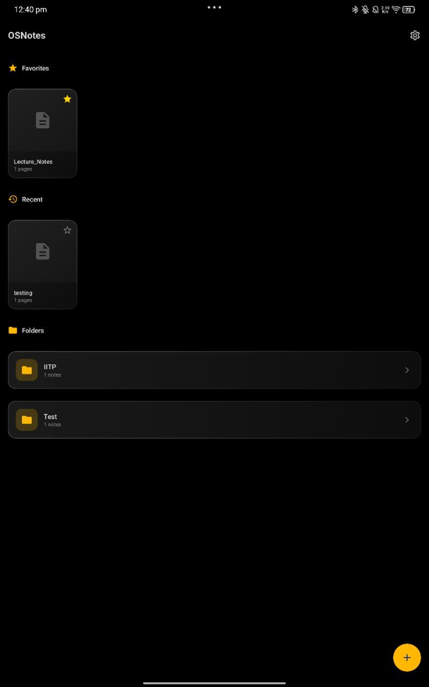
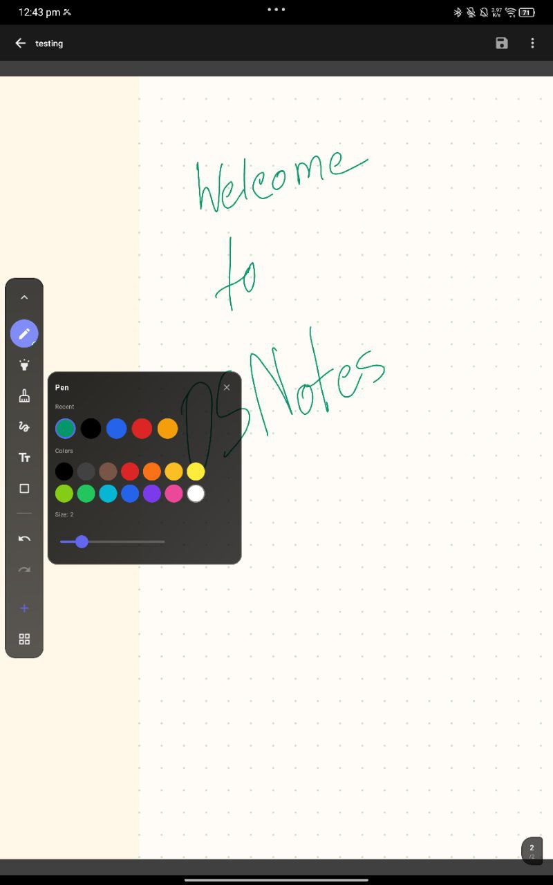

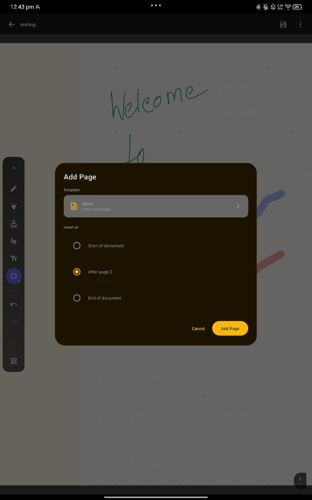
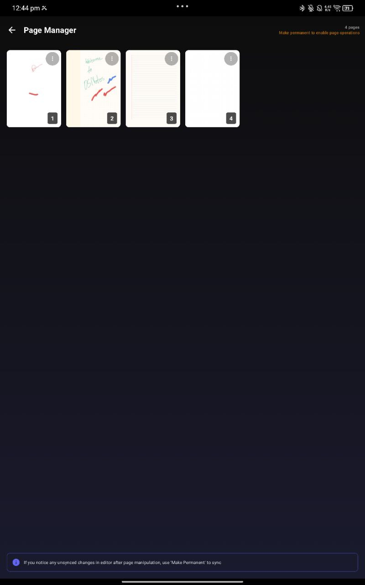
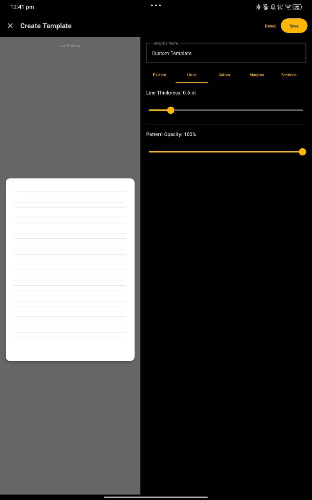
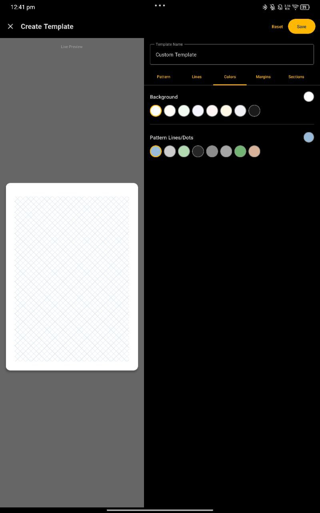
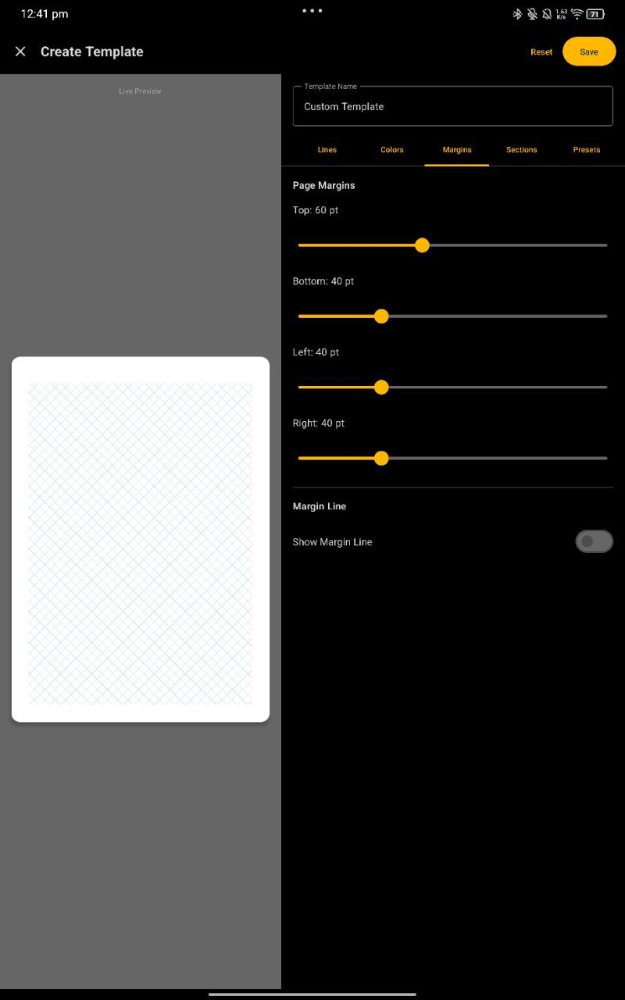
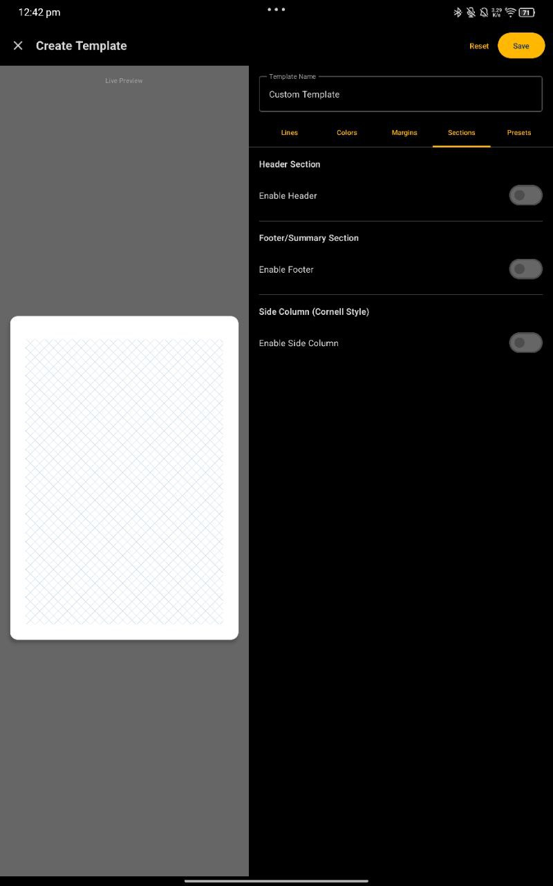
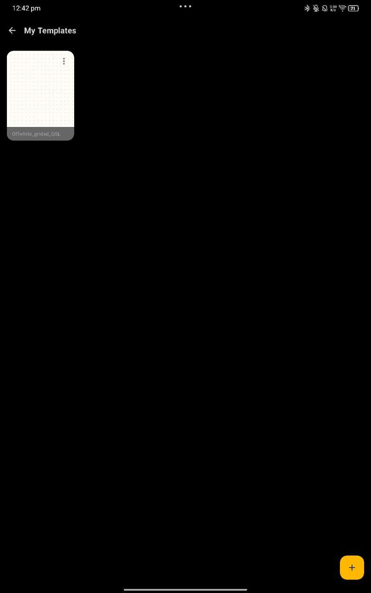
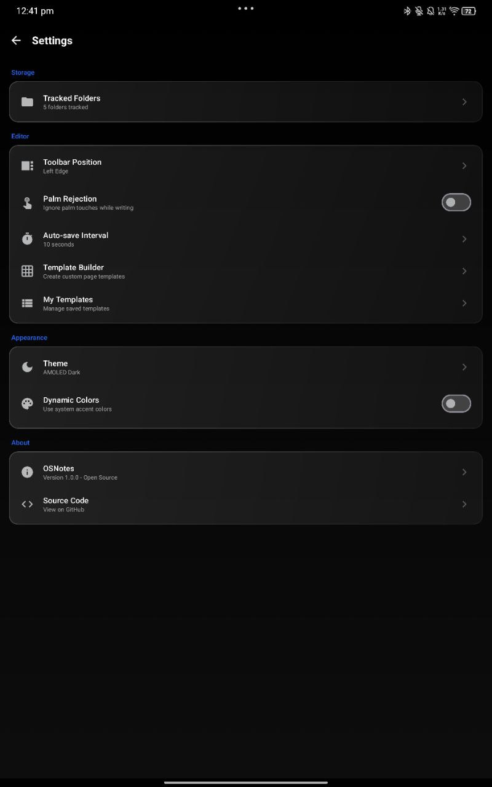
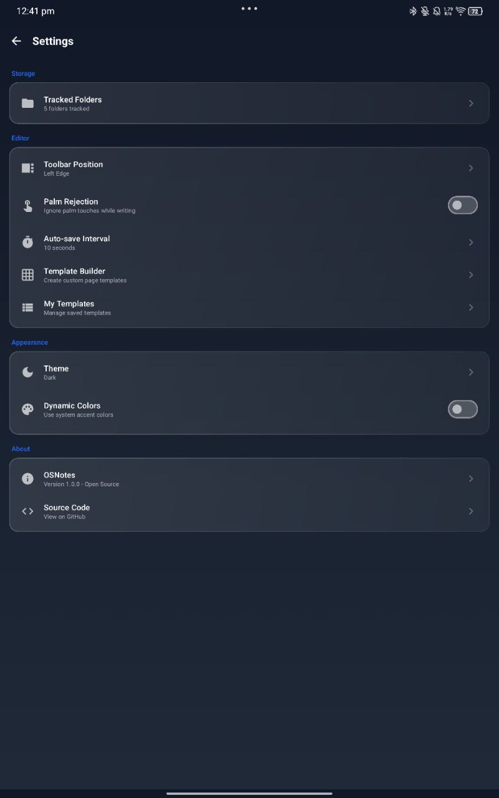
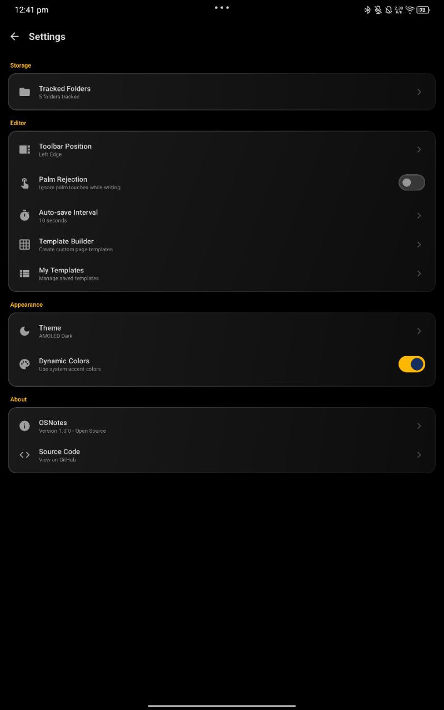
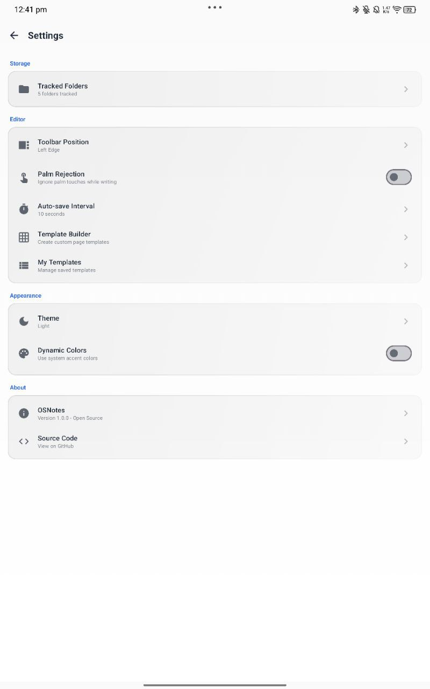
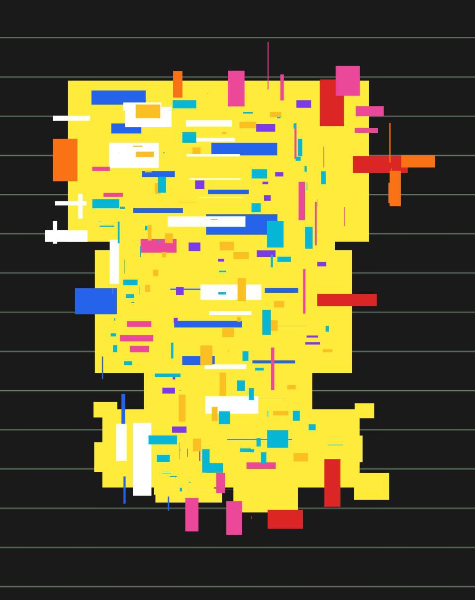


## 🤝 Contributing

Contributions are welcome! Whether it's bug reports, feature requests, or code contributions—every bit helps.

See [CONTRIBUTING.md](CONTRIBUTING.md) for guidelines.

## 🔐 Security

Found a security issue? Please report it responsibly.

See [SECURITY.md](SECURITY.md) for details.

## 📜 License

OSNotes is released under the [GNU Affero General Public License v3.0 (AGPL-3.0)](LICENSE).

This means:
- ✅ You can use, modify, and distribute this software
- ✅ You can use it for commercial purposes
- ⚠️ If you modify and distribute it, you must open-source your changes under AGPL-3.0
- ⚠️ If you run a modified version on a server, you must make the source available to users

See the [LICENSE](LICENSE) file for the full license text.

## 🙏 Acknowledgments

- **Annotation Engine**: Born from [OSPdfReader](https://github.com/nicholasng1998/ospdf-reader)—the engine that started it all
- **MuPDF Team**: For the incredible PDF library that makes this possible
- **Android Community**: For the amazing open-source ecosystem
- **Contributors**: Everyone who helps make OSNotes better

---

## 🌟 Why This Matters

Because note-taking is too important to be controlled by corporations.  
Because your handwritten notes shouldn't be locked in proprietary formats.  
Because "export" shouldn't mean "downgrade."  
Because your creativity deserves freedom.

**If you've ever felt trapped by your note-taking app, OSNotes is for you.**

⭐ **Star this repo** if you believe the same.  
📢 **Share it** with others who are tired of paywalls and vendor lock-in.

---

**Made with ❤️ by a frustrated student for the community. Mostly vibe coded using Kiro, Antigravity and Github copilot (Was exploring different tools and models to understand them better and figure out a better way to develop faster and secure while miniizing token usage)**

[Report Bug](https://github.com/AsokaKrsna/OSNotes/issues)
[Request Feature](https://github.com/AsokaKrsna/OSNotes/issues)
[Discussions](https://github.com/AsokaKrsna/OSNotes/discussions)

### THANKS FOR SUPPORTING THE INITIATIVE